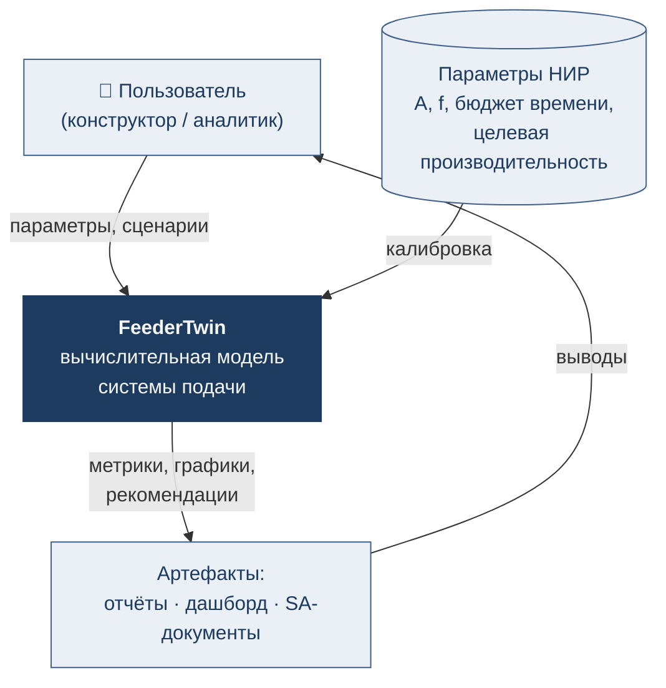
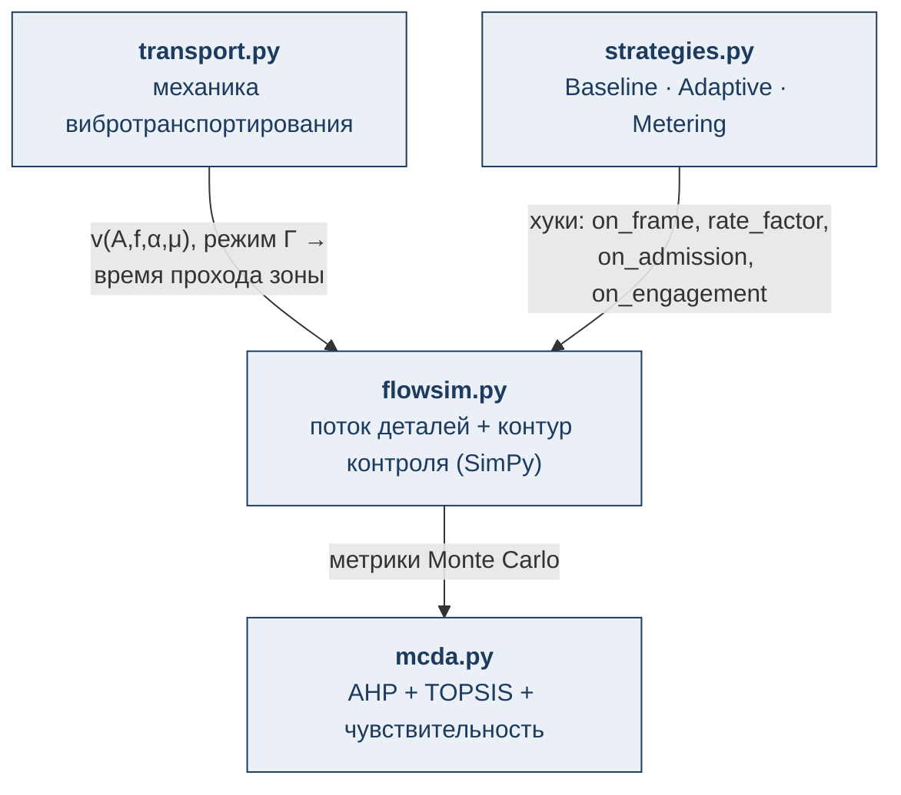
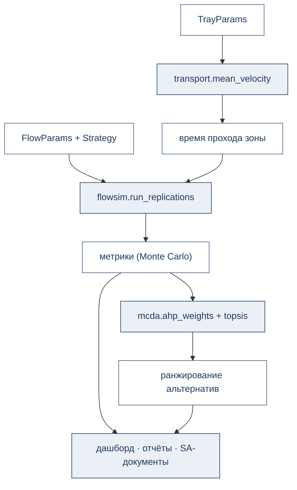

# Архитектура модели

Описание по нотации C4: контекст → контейнеры → компоненты.

## Уровень 1. Контекст

Внешний источник данных — параметры из НИР (амплитуда, частота, бюджет
времени контура, целевая производительность).

## Уровень 2. Контейнеры

| Контейнер | Технология | Назначение |
|---|---|---|
| Расчётное ядро | Python ≥ 3.11, NumPy, SimPy | модели и алгоритмы |
| Сценарии экспериментов | Python + Matplotlib | прогоны, графики, отчёты |
| What-if дашборд | статический HTML + Plotly | интерактивное представление |
| Документация | Markdown / Docusaurus | SA-комплект и сайт |
| CI | GitHub Actions | автоматические тесты и линт |

## Уровень 3. Компоненты расчётного ядра

### Интерфейс стратегии управления

Точки, в которых имитационное ядро опрашивает стратегию:

| Хук | Когда вызывается | Что определяет |
|---|---|---|
| `on_frame(now, positive)` | каждый кадр детектора | вводить ли заслонку |
| `rate_factor(now)` | при генерации прихода | множитель интенсивности вибрации |
| `on_admission(now, rng)` | при входе детали в зону | дозирование (момент след. входа) |
| `on_engagement(now)` | при вводе заслонки | обратная связь стратегии |

Такое разделение обеспечивает требование FR-5 (сменные стратегии) и
гарантирует обратную совместимость: базовая стратегия воспроизводит
поведение исходной модели бит-в-бит (тест `test_baseline_strategy_is_backward_compatible`).

## Поток данных эксперимента

